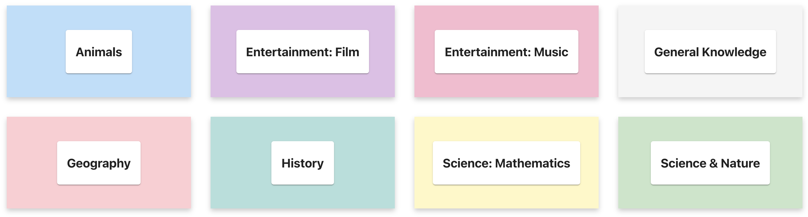
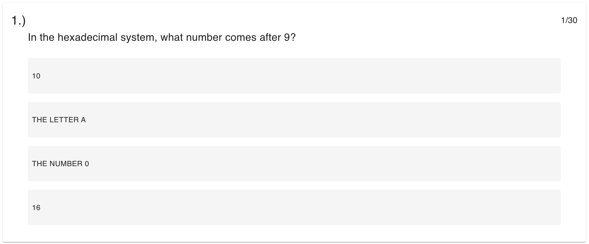

# Trivia

#### Choose a Category!

#### Answer 30 Multiple Choice Trivia Questions

## Project Details

This react app utilizes firebase authentication to register/sign in users, and firebase firestore to serve the database. Choose a category and answer 30 multiple choice questions from the [open trivia database API](https://opentdb.com/api_config.php). View your score and compare with friends!

## To run this project:

1. Clone this repo
2. Run `npm install`
3. Run `npm start`

Additionally, you will need to set up your own database with firestore and save environment variables in a .env file. See the following resources on how to get started.

[Firebase] (https://firebase.google.com/)
[.env] (https://www.npmjs.com/package/dotenv)

### Learn More

This project was bootstrapped with [Create React App](https://github.com/facebook/create-react-app).
You can learn more in the [Create React App documentation](https://facebook.github.io/create-react-app/docs/getting-started).
To learn React, check out the [React documentation](https://reactjs.org/).
